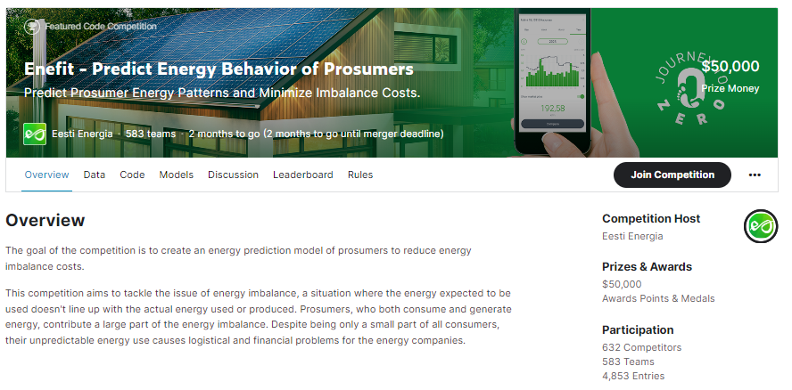
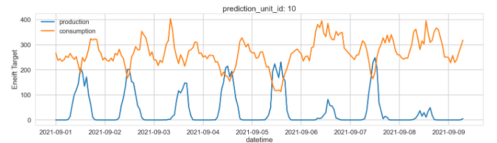
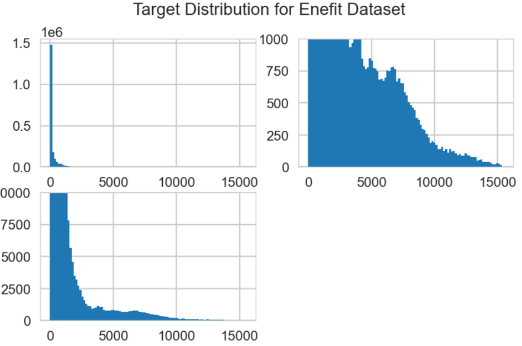
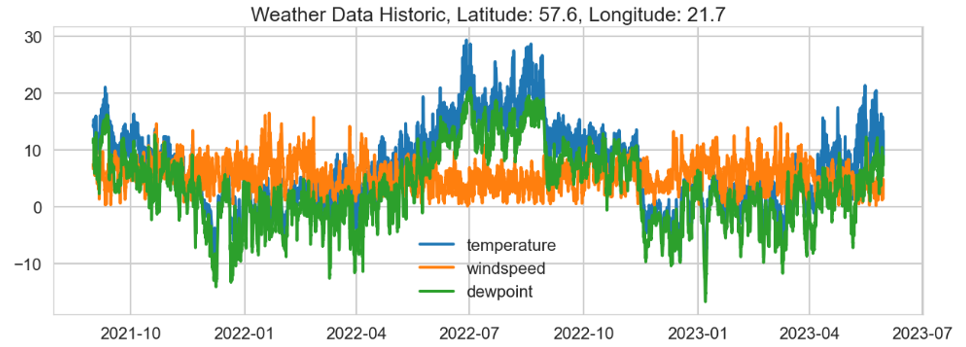

# Enefit-KaggleCompetition-Nov2023toJan2024
Repository aggregating code and materials related to the Kaggle Competition "Enefit - Predict Energy Behavior of Prosumers"

https://www.kaggle.com/competitions/predict-energy-behavior-of-prosumers/overview

The front page of the competition from teh Kaggle site.

We can filter the data and generate a coherent time series view for a subsequence of target values.

## Kaggle Competition Overview

The Enefit Kaggle Machine Learning Competition presents a challenging and crucial task: predicting the energy behavior of prosumers to minimize imbalance costs. Prosumers, individuals or entities who both consume and produce energy, often through solar panels, play a significant role in energy imbalance. This imbalance, a discrepancy between expected and actual energy usage or production, leads to logistical and financial challenges for energy companies.

With the increasing number of prosumers, addressing the issue of energy imbalance becomes vital. If unresolved, it could result in higher operational costs, potential grid instability, and inefficient use of energy resources. Conversely, effectively solving this problem promises to reduce imbalance costs significantly, enhance grid reliability, and facilitate a more efficient and sustainable integration of prosumers into the energy system. It could also encourage more consumers to become prosumers, supporting renewable energy production and use.

Participants in this competition are tasked with predicting the electricity produced and consumed by Estonian energy customers with solar panels. The dataset provided includes weather data, relevant energy prices, and records of installed photovoltaic capacity, offering a comprehensive base for predictive modeling.

Enefit, a leading energy company in the Baltic region, is spearheading this competition. They have recognized the limitations of their internal predictive models and third-party forecasts in accurately forecasting prosumer energy behavior. These methods have fallen short due to their inability to consider the vast range of variables affecting prosumer behavior, resulting in high imbalance costs. Through this competition, Enefit aims to tap into the global pool of data science expertise and explore novel approaches to enhance the accuracy of these predictions and reduce the costs associated with energy imbalance.

The competition is not just a technical challenge but also a step towards a greener and more efficient energy future. It underscores the importance of innovative data science in tackling real-world problems, especially in the dynamic and ever-evolving energy sector.

